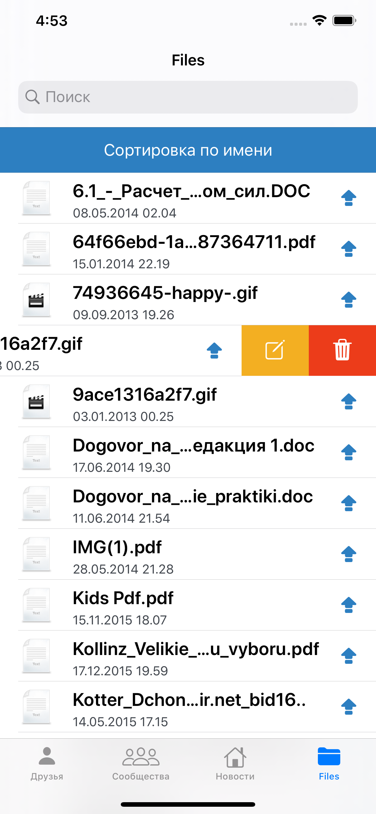
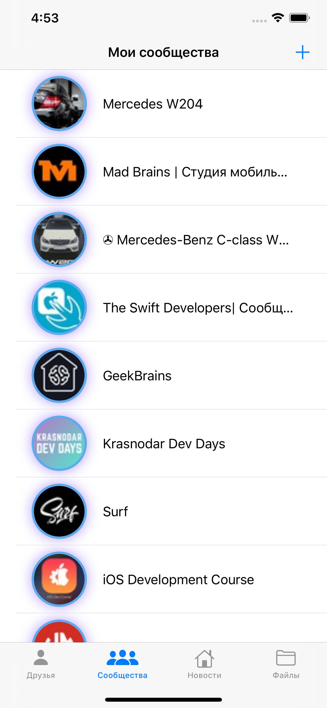
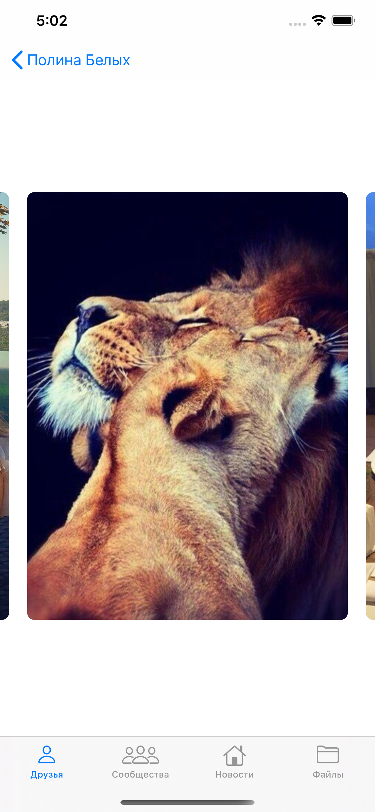

# VK_GeekBrains
Клиент для социальной сети VK.

## Цель проекта 
- Использование различных способов реализации задач. 
- Знакомство с различными инструментами разработки.
- Отработка на практике полученных знаний. 

## Какие технологии можно найти в проекте 
- Проектировние интерфейса с помощью StoryBoard
- Создание кастомных UI элементов (Папка View содержит кастомные view и control)
- Анимации view, layer а так же переходов между экранами. (Анимации экранов в папке Controller/ Interaction controllers и Animation controllers)
- Работа с API ( URLSession ). Запросы находятся в NetworkingService.
- Realm ( RealmManager используется для сохранения данных на устройстве: список друзей и сообществ )
- FileManager ( Используется для кэширования изображений для таблиц и коллекций а так же для сохранения файлов ImageService, NetworkingService.downloadFile(...) )
- Operation (Helpers -> AsyncOperation, NetworkingService -> Operation)

## Pods 
Для корректной работы используйте данные версии без обновления: 
  
  pod 'RealmSwift', '~> 5.0.0'
  pod 'Firebase/Database'
  pod "PromiseKit", "~> 6.8"
  
## Предупреждение 

❗️ Удаление групп/файлов в приложении приведет к реальному удалению групп/файлов пользователя. 

### Примеры экранов:

       

     
  
